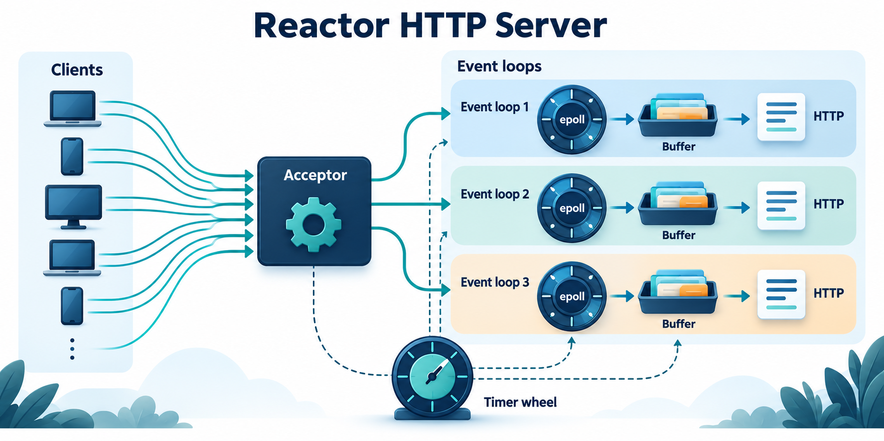
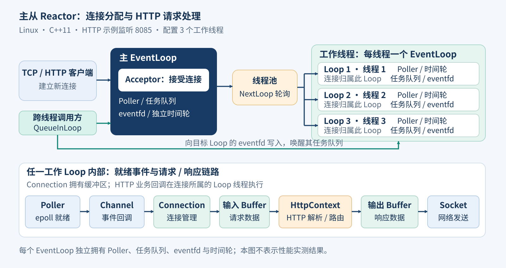

# Reactor HTTP Server



基于 Linux epoll 的 C++11 TCP 服务框架，通过主从 Reactor 和每线程一个事件循环组织连接处理，并提供 Echo 与 HTTP 服务示例。

核心实现位于 [http_v1/server.hpp](http_v1/server.hpp)。本项目适合学习事件驱动网络编程、跨线程任务投递、连接生命周期与 HTTP 请求解析。下文依据已提交源码整理；构建、运行及性能结果尚未在干净环境中复核。

## 已实现的能力

- **TCP 框架**：套接字封装、输入/输出缓冲区、事件分发、连接状态与回调。
- **主从 Reactor**：主循环负责接受连接，工作循环轮询分配连接；每个工作线程持有自己的 EventLoop。
- **跨线程任务**：互斥锁保护任务队列，通过 eventfd 唤醒事件循环。
- **超时管理**：timerfd 驱动时间轮，支持定时任务及非活跃连接回收。
- **HTTP 示例**：分阶段解析请求行、请求头和正文；静态资源、正则路由、URL 解码、MIME 类型和长连接。
- **演示与验证材料**：Echo 服务、手工 TCP/HTTP 客户端、大文件样本及随附 WebBench 压测工具。

HTTP 示例注册以下路由：

| 路由 | 当前行为 |
| --- | --- |
| GET /hello | 将解析后的请求组织为文本并返回 |
| POST /login | 回显请求；尚未实现用户登录或认证 |
| PUT /123.txt | 将正文写入静态目录中的演示文件；会覆盖原内容 |
| DELETE /123.txt | 回显请求；尚未实现文件删除 |
| GET /、GET /index.html | 返回静态目录中的首页 |

## 架构



```text
客户端
  → Acceptor / 主 EventLoop
  → LoopThreadPool：轮询分配工作 EventLoop
  → Connection / Channel / Poller(epoll)
  → 输入缓冲区 → Echo 或 HTTP 解析与路由
  → 输出缓冲区 → socket 写事件
```

eventfd 负责跨线程唤醒，timerfd 与 TimerWheel 负责超时任务。业务处理回调在连接所属的事件循环线程内执行。

## 目录

```text
http_v1/
├── server.hpp           TCP 框架及 Reactor 核心
├── echo/                Echo 示例，监听 8500
└── http/
    ├── http.hpp         HTTP 解析、路由、静态文件与响应
    ├── main.cc          HTTP 示例，监听 8085，配置 3 个工作线程
    ├── makefile
    └── wwwroot/         首页与演示文件
testdata/                手工连接、超时、不完整正文与大文件测试客户端
mudo/                    Any、Socket、时间轮的独立练习
WebBench-master/         随附 WebBench 源码及其说明/许可证
docs/images/            项目概览与架构图
```

## 环境要求

- Linux：核心使用 epoll、eventfd、timerfd，不能直接按这些命令在原生 Windows 上运行。
- 支持 C++11 的 g++、GNU make、pthread。
- curl 用于 HTTP 验证；Python 3 可用于下面的 Echo 验证。
- WebBench 为可选工具，具体构建说明见其 [README](WebBench-master/README.md)。

Ubuntu/Debian 可准备基础工具：

```bash
sudo apt update
sudo apt install build-essential curl python3
```

## 构建与运行

```bash
git clone https://github.com/759stronger/reactor-http-server.git
cd reactor-http-server
make -B -C http_v1/http
cd http_v1/http
./main
```

使用 `make -B` 强制从源码重新构建，避免仓库内已提交的二进制被直接复用。makefile 的实际编译规则是 `g++ -std=c++11 main.cc -o main -lpthread`。

**请从 `http_v1/http` 目录启动 HTTP 示例。** 程序通过相对路径 `./wwwroot/` 查找静态文件。端口和线程数量目前写在 `main.cc` 中；需要调整时应修改示例入口并重新构建。

另开终端，在仓库根目录构建和运行 Echo 示例：

```bash
make -B -C http_v1/echo
cd http_v1/echo
./main
```

Echo 示例监听 8500，配置 2 个工作线程和 10 秒非活跃超时。HTTP 与 Echo 示例使用不同端口，可分别启动。

## 最小验证

HTTP 服务运行后，在另一终端执行：

```bash
curl -i http://127.0.0.1:8085/
curl -i http://127.0.0.1:8085/hello
```

预期：根路径返回演示首页；`/hello` 返回文本格式的请求信息。当前请求头回显中的换行格式仍是演示实现，不适合用它验证完整 HTTP 兼容性。

Echo 服务运行后，可执行：

```bash
python3 - <<'PY'
import socket

with socket.create_connection(("127.0.0.1", 8500), timeout=5) as client:
    payload = b"hello reactor"
    client.sendall(payload)
    received = bytearray()
    while len(received) < len(payload):
        chunk = client.recv(4096)
        if not chunk:
            break
        received.extend(chunk)
    assert bytes(received) == payload, (payload, bytes(received))
    print("Echo 验证通过")
PY
```

这些命令提供预期行为，尚未作为已通过的测试结果。已有更多手工验证材料位于 `testdata/`；其中部分客户端含循环或会覆盖演示文件，运行前应阅读对应源码。

## 性能与边界

- **高并发是架构目标，尚无本服务器的实测并发量、QPS 或延迟报告。** 随附 WebBench README 中的并发数字描述工具能力，不代表此服务器已经达到该能力。
- HTTP 实现是学习用子集；未验证完整 HTTP 协议兼容性、TLS 或公网部署需求。
- 静态文件采用同步整文件读入内存，业务处理也在 EventLoop 中执行；大文件和耗时回调可能拖延同一循环上的其他连接。
- Content-Length 直接做数值转换，正文没有整体大小上限；畸形长度与大请求的保护需要完善。
- 项目包含手工测试客户端，但尚未形成自动化回归测试、CI 和可重复的压测报告。

## 后续完善

1. 固定可复现的构建环境，补齐 TCP/HTTP/超时的自动化测试。
2. 完善请求长度、异常处理、HTTP 边界与连接生命周期。
3. 改进大文件发送和耗时业务调度，再进行有环境记录的并发与延迟测试。

## 许可证

随附 WebBench 的许可证见 [WebBench-master/LICENSE](WebBench-master/LICENSE)。当前仓库尚未为自有服务器代码提供独立许可证；WebBench 的许可声明不应自动视为整个仓库的授权。
